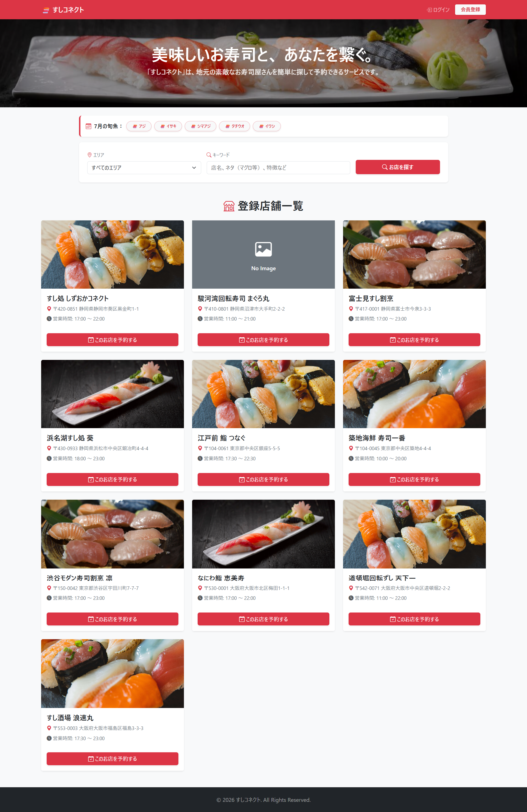
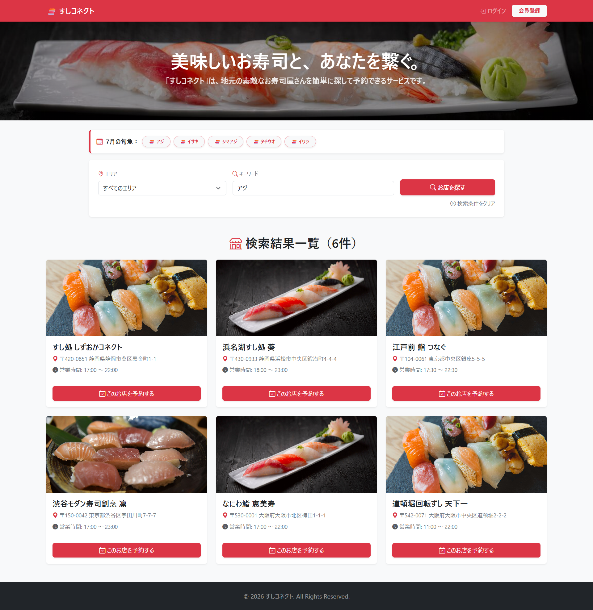
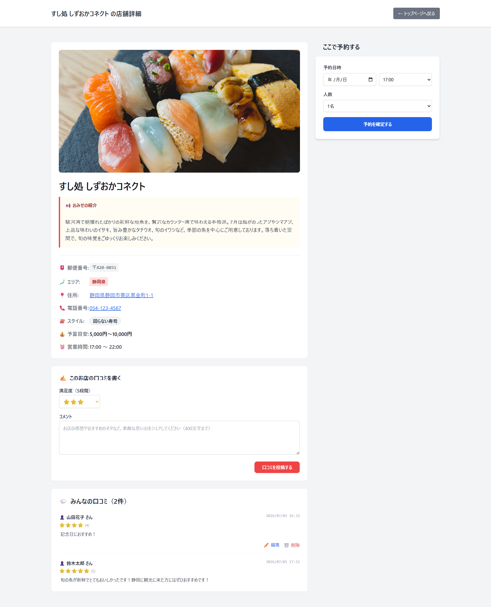
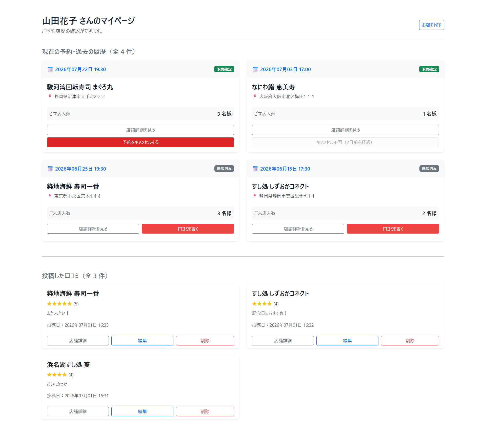
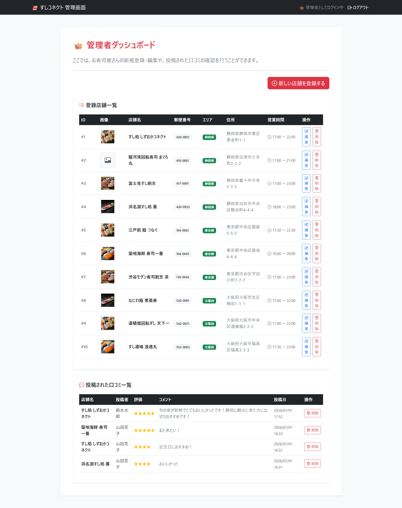
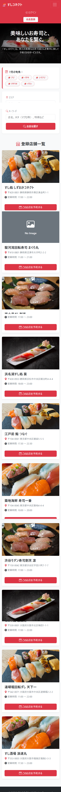
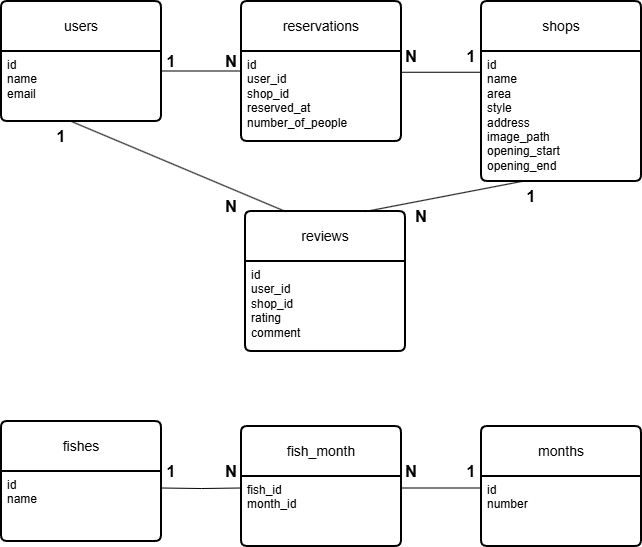

# 🍣 すしコネクト

**Laravelを使用した寿司予約Webアプリ**

旬の魚からも店舗検索ができる、寿司屋特化型の予約Webアプリです。

## 🌐 デモサイト

👉 https://sushi-connect.onrender.com

※ Render無料プランを利用しているため、初回アクセス時は起動まで30〜60秒ほどかかる場合があります。


## アプリ概要

**🍣 すしコネクト**は、エリア・キーワード・旬の魚から店舗を検索し、予約や口コミ投稿ができるWebアプリです。

お寿司が好きで、「旬の魚からそのままお店を探せたら面白いのではないか」と考えたことが、このアプリを制作したきっかけです。

また、大手チェーン店だけでなく、地方の個人経営のお寿司屋さんも気軽に見つけられるサービスを目指して開発しました。


## スクリーンショット

### 🏠 トップページ

エリア・キーワード・旬の魚から店舗を検索できます。店舗画像が未登録の場合は「No Image」を表示します。



### 🔍 店舗検索

エリア・キーワード検索に加え、トップページの旬の魚からも店舗検索できます。



### 🍣 店舗詳細

店舗情報の閲覧、予約、口コミの投稿・閲覧ができます。



### 📅 マイページ

予約履歴の確認・キャンセルや、自分が投稿した口コミの編集・削除ができます。



### 🛠️ 管理画面

管理者は店舗情報の登録・編集・削除や、口コミの管理を行えます。



### 📱 レスポンシブ対応

スマートフォンでも快適に利用できるよう、レスポンシブ対応を行いました。



## 主な機能

### 👤 一般ユーザー

- 会員登録・ログイン
- エリア・キーワード検索
- 旬の魚から店舗検索
- 店舗詳細の閲覧
- 店舗予約
- 予約履歴の確認・キャンセル
- 口コミ投稿
- 口コミ編集・削除
- マイページで予約・口コミ管理

### 🛠️ 管理者

- 管理者ログイン
- 店舗の登録・編集・削除
- 口コミの削除

### ✨ 予約機能

- 30分単位の予約バリデーション
- 営業時間外の予約防止
- ダブルブッキング防止

### 📱 UI

- Bootstrap 5 と Tailwind CSS を併用し、PC・スマートフォンの両方で見やすい画面になるよう調整しました。
- 店舗画像未登録時には「No Image」を表示し、レイアウトが崩れないよう工夫しました。


## 使用技術

| カテゴリ | 技術 |
|----------|------|
| バックエンド | PHP 8.2 / Laravel 8.83.29 |
| フロントエンド | HTML / CSS / Bootstrap 5 / Tailwind CSS / JavaScript |
| データベース（開発） | MariaDB（XAMPP） |
| データベース（本番） | PostgreSQL（Neon） |
| ORM | Eloquent ORM |
| 認証 | Laravel Breeze |
| 日時処理 | Carbon |
| テンプレートエンジン | Blade |
| メール | Mailtrap（開発環境） |
| 開発環境 | Visual Studio Code / XAMPP |
| コンテナ | Docker |
| デプロイ | Render |
| バージョン管理 | Git / GitHub |

## ER図

現在の実装に合わせたデータベース設計です。



## 工夫した点

### 🍣 旬の魚から店舗検索

一般的な飲食店予約サイトでは店舗名やエリアから検索することが多いですが、本アプリではトップページに「今月の旬の魚」を表示し、魚の名前から店舗検索できる機能を実装しました。

Laravelの多対多リレーション（Fish・Month・fish_month）を利用し、現在の月に応じた旬の魚を表示しています。表示された魚をクリックすると、その魚を扱う店舗を検索できます。

### ⏰ 予約時の入力チェック

予約時には以下のチェックを行っています。

- 30分単位の予約
- 営業時間内のみ予約可能
- 同一ユーザーのダブルブッキング防止

これらをLaravelのバリデーションやCarbonを利用し、不正な予約を防ぐことで、実際の予約システムを意識した実装を行いました。

### 📱 レスポンシブ対応

BootstrapとTailwind CSSを使用し、スマートフォンでもレイアウトが崩れないようレスポンシブ対応を行いました。

## 苦労した点

当初はSQL中心で考えていたため、多対多リレーションをEloquentで表現する考え方を理解するまで時間がかかりました。

特に「旬の魚から店舗検索」機能では、多対多リレーションを利用しているため、Fish・Month・fish_monthのリレーションを理解するまでに苦労し、ER図に整理することでデータベース構造への理解を深めました。

また、予約機能ではCarbonを利用した営業時間チェックや、同一ユーザーのダブルブッキング防止処理を実装し、実際の予約システムを意識しながら実装を進めました。

## 開発途中で追加した機能

開発当初の設計にはありませんでしたが、使いやすさや実用性を高めるため、以下の機能を追加しました。

- 店舗画像の表示（未登録時は No Image を表示）
- 口コミ編集・削除機能
- 管理者による口コミ削除機能
- スマートフォン向けレスポンシブ対応
- 30分単位の予約バリデーション
- 営業時間外予約防止
- ダブルブッキング防止

## 今後追加したい機能

- 店舗側が予約状況を確認・管理できる機能
- 写真付き口コミ投稿機能
- 星評価順・口コミ件数順での並び替え機能
- お気に入り店舗機能

## セットアップ

```bash
git clone <リポジトリURL>

cd sushi-connect

composer install

cp .env.example .env

php artisan key:generate

php artisan migrate --seed

php artisan serve
```

### 開発環境

- XAMPP（MariaDB）
- PHP 8.2
- Composer

※ `.env` のデータベース設定を自身の環境に合わせて変更してください。


## 学んだこと

- LaravelのMVCアーキテクチャ
- Eloquent ORM
- 多対多リレーション
- Carbonによる日時処理
- Git / GitHubを用いたバージョン管理

## ライセンス

本リポジトリはポートフォリオとして公開しています。
